Exercice 1: 
1.b : 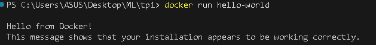
1.c : Cette commande montre tous les conteneurs déjà créés, même arrêtés. Elle permet d’inspecter l’historique des conteneurs, leur statut, l’image utilisée et leur nom.
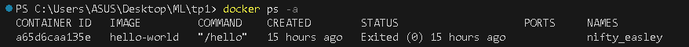

Exercice 2:
2.a : Une image Docker est un modèle immuable décrivant un environnement. Un conteneur est une instance active de cette image : c’est l’image en cours d’exécution, avec son propre système de fichiers et ses processus.
2.b : 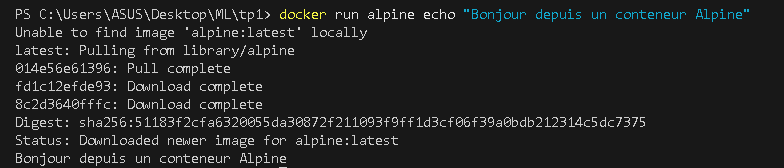
Docker télécharge l’image alpine si elle n’est pas déjà présente.
Docker crée un conteneur temporaire basé sur cette image.
La commande echo "Bonjour..." s’exécute dans le conteneur.
Le conteneur s’arrête immédiatement après, car la commande a fini.
2.c : 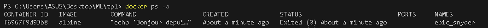
Le conteneur Alpine apparaît avec le statut Exited parce que la commande echo s'est terminée. Un conteneur s’arrête automatiquement dès qu’il n’a plus de processus à exécuter.
2.d : 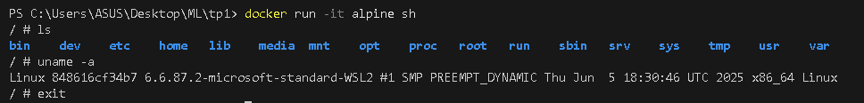
En mode interactif, j’observe un environnement Linux minimal. La commande ls montre les dossiers système d’Alpine, uname -a confirme que j'exécute un noyau Linux à l’intérieur du conteneur, et exit ferme le shell et arrête le conteneur.

Exercice 3:
3.a : J’ai complété le fichier app.py pour créer une API FastAPI minimale exposant une route /health qui renvoie un JSON {"status": "ok"}.
3.b : Le Dockerfile crée une image basée sur Python 3.11, copie l’application FastAPI, installe les dépendances (FastAPI et Uvicorn) puis démarre le serveur sur le port 8000 grâce à une instruction CMD.
3.c : 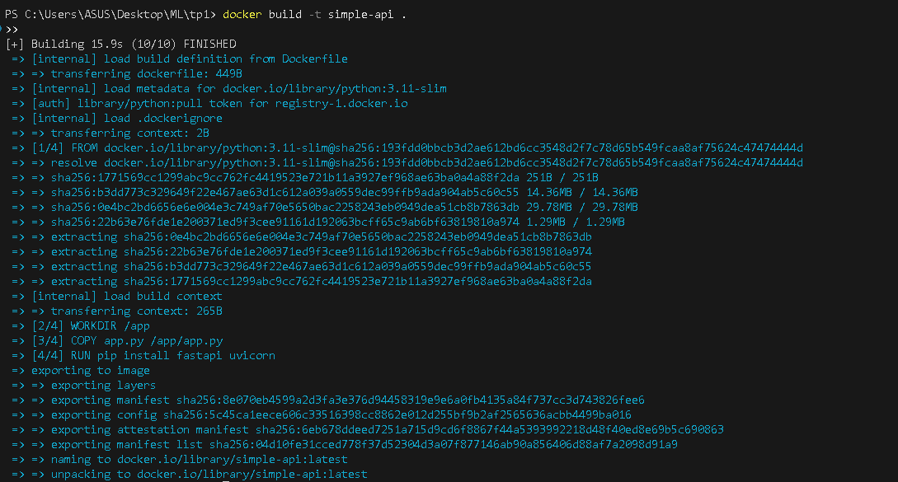

Exercice 4:
4.a : L’option -p 8000:8000 relie le port 8000 du conteneur au port 8000 de ma machine hôte. Cela permet d’accéder à l’API FastAPI qui tourne dans le conteneur via http://localhost:8000.
4.b : 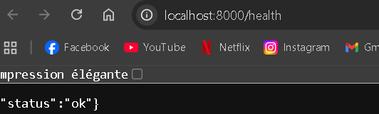
La réponse JSON correspond bien au comportement défini dans app.py.
4.c : 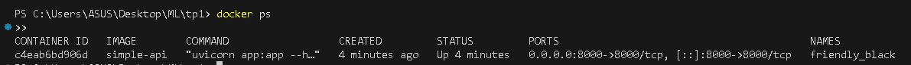
Nom du conteneur : friendly_black
Image utilisée : simple-api
Port mappé : 8000->8000
4.d : 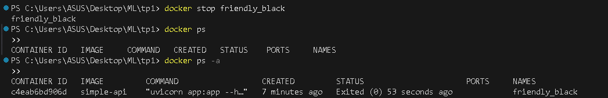
docker ps affiche uniquement les conteneurs en cours d’exécution.
docker ps -a affiche tous les conteneurs, y compris ceux arrêtés (Exited).

Exercice 5:
5.c : 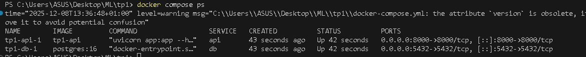
La commande docker compose up -d démarre les deux services en arrière-plan. La commande docker compose ps confirme que db et api sont en cours d’exécution.
5.d : 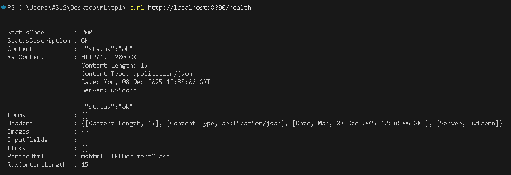
5.e : docker compose down arrête tous les conteneurs définis dans le fichier docker-compose.yml et les supprime, mais laisse les volumes nommés intacts.
docker stop <id> arrête uniquement un conteneur individuel, sans le supprimer, et ne concerne pas les autres services de la stack.
(Et docker compose down -v supprime en plus les volumes nommés, donc les données associées.)

Exercice 6:
6.a : La commande docker compose exec db psql -U demo -d demo permet d’ouvrir un shell PostgreSQL à l’intérieur du conteneur db. L’option -U spécifie l’utilisateur, -d la base de données, et exec exécute la commande dans le conteneur déjà lancé.
6.b : 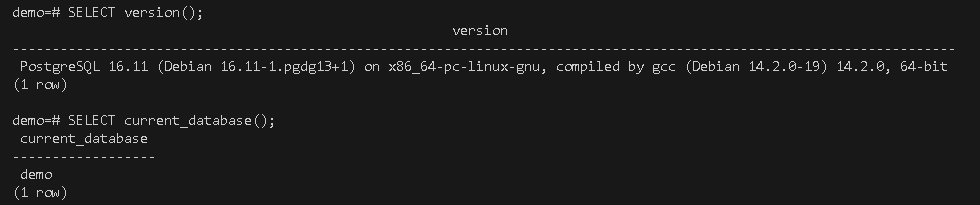
SELECT version() affiche la version de PostgreSQL.
SELECT current_database() confirme que la base active est demo.
6.c : Depuis un autre conteneur de la stack (par exemple api), la base est accessible via :
hostname : db
port : 5432
user / password / db : demo / demo / demo
6.d : docker compose down arrête et supprime les conteneurs, mais conserve les volumes nommés (les données restent).
docker compose down -v supprime en plus les volumes attachés aux services, ce qui efface définitivement les données persistées (par exemple le contenu de la base PostgreSQL).

Exercice 7:
7.a : 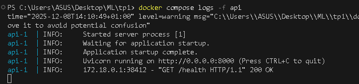
Cette commande permet de vérifier que l’API s’exécute et reçoit des requêtes.
7.b : 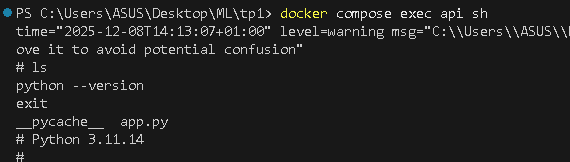
En entrant dans le conteneur avec docker compose exec api sh, j’ai pu vérifier la présence du fichier app.py et confirmer la version de Python utilisée. Cette technique est essentielle pour valider le contenu d’une image et diagnostiquer des erreurs de dépendances ou de fichiers manquants.
7.c : 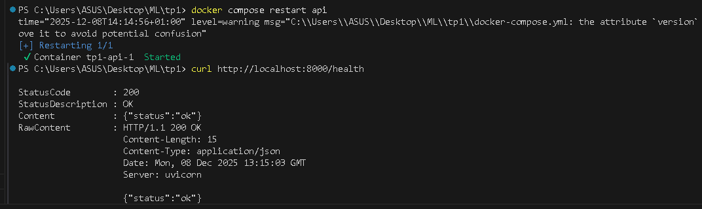
Après redémarrage avec docker compose restart api, l’API répond toujours sur /health.
Redémarrer un service est utile lorsqu’on modifie des variables d’environnement, que l’application plante temporairement ou qu’un fichier a été mis à jour mais que le conteneur n’a pas besoin d’être reconstruit.
7.d : 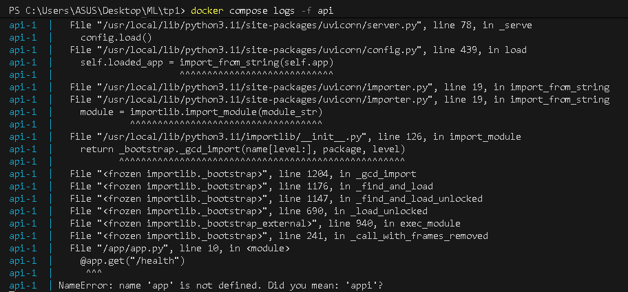
Cela m’a permis d’identifier la cause : le nom de la variable FastAPI était incorrect.
Le débogage se fait toujours via docker compose logs, car modifier du code dans un conteneur en cours d’exécution n’a aucun effet : il faut reconstruire l’image.
7.e : Il est utile de nettoyer régulièrement l’environnement Docker, car les conteneurs arrêtés et les images inutilisées occupent de l’espace disque, ralentissent les builds et compliquent le travail de débogage.

Exercice 8:
8.a : Un notebook Jupyter n’est pas adapté à la production car il manque de reproductibilité (exécution non linéaire, états cachés) et ne garanrit pas un environnement stable (versions, dépendances).
Il n’est pas automatisable, ne peut pas servir une API et n’est pas conçu pour le monitoring ou l’orchestration.
Docker résout ces problèmes en fournissant un environnement isolé et reproductible.
8.b : Docker Compose permet de lancer plusieurs services en une seule commande et de gérer automatiquement les réseaux, ports, dépendances et volumes.
Dans le TP, il a permis de démarrer l’API et PostgreSQL ensemble, déjà connectés, ce qui simplifie énormément la mise en place d’un système multi-conteneurs et garantit un environnement reproductible.