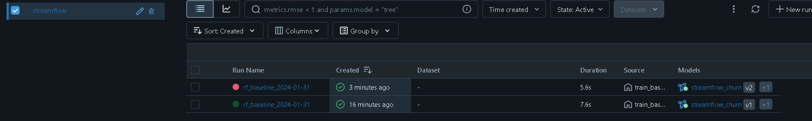
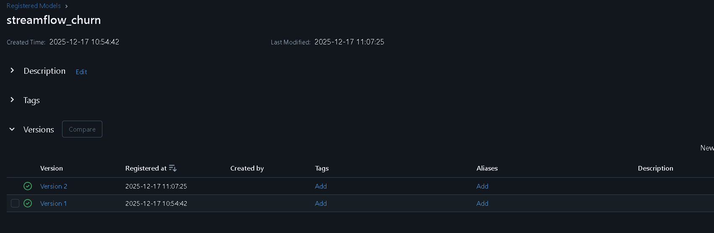
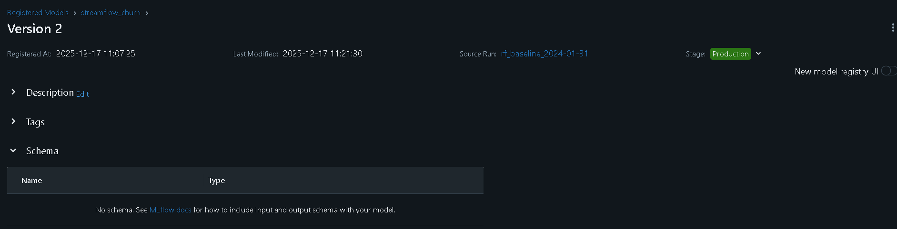
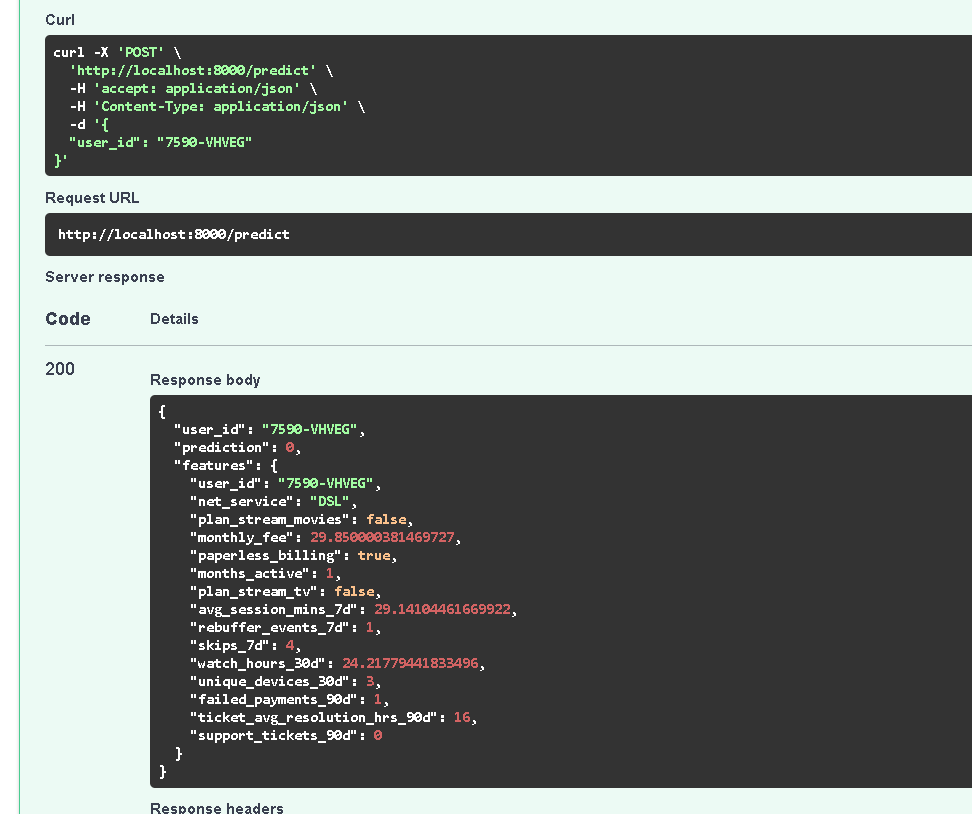
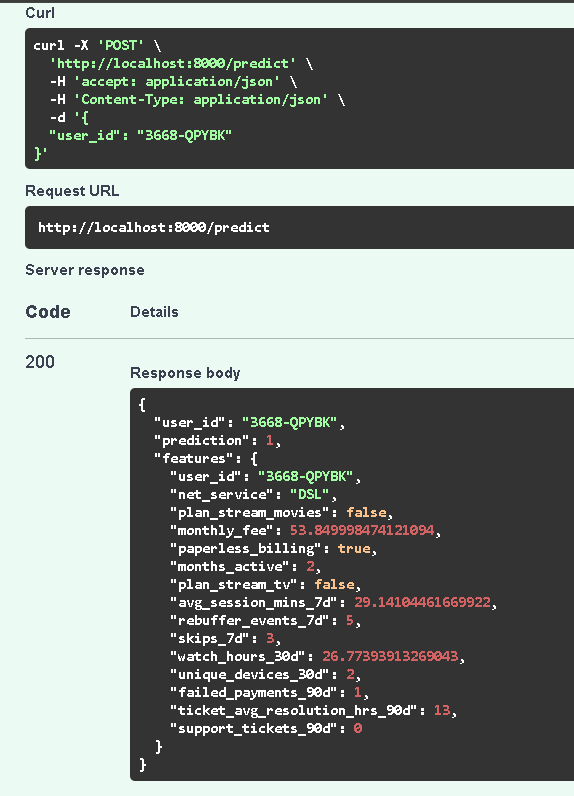

Exercice 1 : 
1.e : 
PS C:\Users\ASUS\Desktop\ML\tp1> curl http://localhost:8000/features/5575-GNVDE
StatusCode        : 200
StatusDescription : OK
Content           : {"user_id":"5575-GNVDE","features":{"months_active":34,"monthly_fee":56.95000076293945,"paperless_billing":false}}
RawContent        : HTTP/1.1 200 OK
                    Content-Length: 114
                    Content-Type: application/json
                    Date: Wed, 17 Dec 2025 09:40:38 GMT
                    Server: uvicorn

                    {"user_id":"5575-GNVDE","features":{"months_active":34,"monthly_fee":56.95...
Forms             : {}
Headers           : {[Content-Length, 114], [Content-Type, application/json], [Date, Wed, 17 Dec 2025 09:40:38 GMT], [Server, uvicorn]}
Images            : {}
InputFields       : {}
Links             : {}
ParsedHtml        : mshtml.HTMLDocumentClass
RawContentLength  : 114

La stack lance PostgreSQL qui stocke les tables et snapshots.
Prefect orchestre les flows d’ingestion/snapshots. Feast sert de feature store : il lit les snapshots et expose les features matérialisées.
MLflow tourne pour tracer les entraînements (paramètres, métriques, artefacts) et gérer le registry de modèles.
L’API FastAPI expose des endpoints et servira ensuite à faire du serving via le modèle en Production.

Exercice 2 : 
2.c : 
AS_OF utilisé : 2024-01-31

Nombre de lignes du dataset après merge : train_rows_after_merge : 7043

Colonnes catégorielles détectées (cat_cols) : 

Métriques (validation) + temps d’entraînement : net_service

AUC : 0.6188834096512857

F1 : 0.05194805194805195

ACC : 0.7512776831345827

Temps d’entraînement : 1.1190590858459473

2.d : Fixer AS_OF permet de figer la coupe temporelle du dataset : on récupère toujours les mêmes snapshots et labels à une date donnée. Sans ça, les données peuvent changer (autres snapshots, features différentes), et les métriques ne seraient plus comparables entre runs.
Fixer random_state stabilise tout ce qui est aléatoire (split train/validation, tirages internes du RandomForest). Ça garantit que deux exécutions avec le même code et les mêmes données donnent des résultats proches, et que les écarts observés viennent vraiment d’un changement plutôt que du hasard.
Dans une démarche MLOps orientée reproductibilité, ces deux paramètres sont essentiels pour tracer, comparer et promouvoir un modèle de manière fiable.

Exercice 3 : 
3.a : 
L’expérience MLflow utilisée pour l’entraînement est streamflow. Elle regroupe l’ensemble des runs liés aux modèles de churn entraînés dans le projet StreamFlow.

3.b: 
Le run contient les paramètres d’entraînement, les métriques de validation (AUC, F1, Accuracy). MLflow centralise ainsi toutes les informations nécessaires à l’analyse et à la reproductibilité du run.

3.c : 
Le modèle streamflow_churn apparaît dans le Model Registry. Il a été enregistré automatiquement par le script d’entraînement

3.e.: 
Model Registry montrant v2 → Production.

3.g : La promotion d’un modèle via des stages MLflow (None, Staging, Production) permet de séparer clairement les phases du cycle de vie d’un modèle sans dépendre de chemins locaux ou de fichiers spécifiques. Elle offre une source de vérité centralisée sur la version réellement utilisée en production. Cette approche facilite les rollbacks, les audits et la collaboration entre data scientists et équipes de production. Contrairement à un déploiement manuel, elle réduit fortement les erreurs humaines et garantit que l’API consomme explicitement un modèle validé et promu.

Exercice 4 :

Pointer l’API vers models:/streamflow_churn/Production garantit que le service utilise la version officiellement validée et promue via le Model Registry, plutôt qu’un fichier local potentiellement obsolète. Le stage “Production” centralise la décision de déploiement (promotion/rollback) sans changer le code de l’API. Cela améliore la traçabilité : on peut relier chaque prédiction à une version précise du modèle et à ses runs. À l’inverse, un .pk local ou un artefact de run nécessite un déploiement manuel, augmente le risque d’erreurs humaines, et complique la reproductibilité. Enfin, le registry facilite la collaboration et l’automatisation CI/CD autour du cycle de vie du modèle.

Exercice 5 :

En serving, une grande partie des pannes modèle viennent en réalité des features. Premier cas : entité absente, le user_id demandé n’existe pas dans l’online store Feast, donc get_online_features renvoie des None et l’API échoue avec missing_features (on détecte tôt en vérifiant les valeurs manquantes avant d’appeler le modèle). Deuxième cas : online store incomplet / obsolète la matérialisation (feast materialize) est manquante ou pas à jour (fenêtre temporelle insuffisante, job non relancé), ce qui produit aussi des None ou des valeurs incohérentes côté API. Les garde-fous minimaux sont : 
(1) refuser une prédiction si une feature requise est None, 
(2) renvoyer une erreur explicite et actionnable (missing_features + liste des features manquantes), 
et (3) garder une réponse JSON structurée pour faciliter le debug.

Exercice 6 :
6.a : MLflow garantit la traçabilité des entraînements en enregistrant pour chaque run les paramètres, les métriques et les artefacts. Chaque entraînement est ainsi historisé, comparable et rattaché à un run_id unique.
MLflow permet aussi une identification claire des modèles servis grâce au Model Registry : chaque modèle est versionné, associé à un run précis et peut être promu dans un stage (Staging, Production), ce qui rend explicite quel modèle est censé être utilisé par l’API.

6.b : Concrètement, le stage Production indique à l’API quel modèle charger automatiquement au démarrage. L’API ne dépend donc pas d’un chemin de fichier ou d’un run_id codé en dur.
Cela permet de changer de modèle sans redéployer l’API : une promotion dans MLflow suffit. En revanche, cela empêche aussi toute ambiguïté : un seul modèle est considéré comme officiel en production à un instant donné.

6.c : Même avec MLflow, la reproductibilité peut échouer à plusieurs niveaux :
Données : snapshots différents, labels modifiés, ou AS_OF mal fixé entraînent un dataset d’entraînement différent.
Features : une modification du Feature Store ou une matérialisation différente peut changer les valeurs vues à l’entraînement ou au serving.
Code : un changement du pipeline de preprocessing ou de l’API sans retraining invalide le modèle.
Environnement : versions de librairies Python différentes peuvent produire des comportements divergents malgré le même modèle.
Configuration : variables d’environnement incorrectes ou incohérentes entre services.