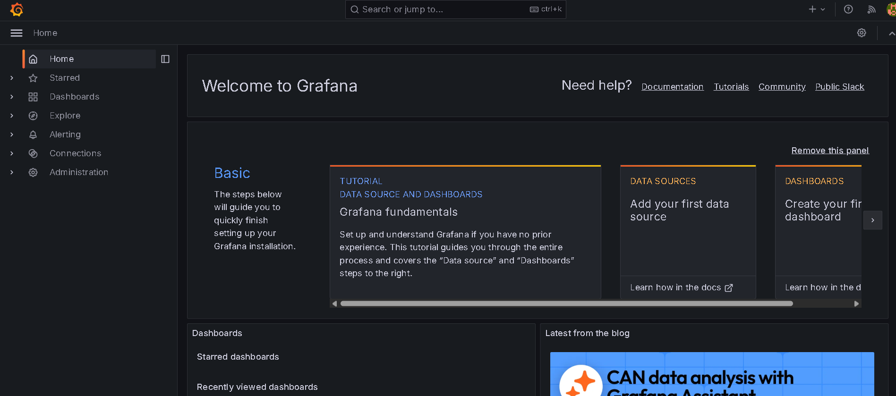
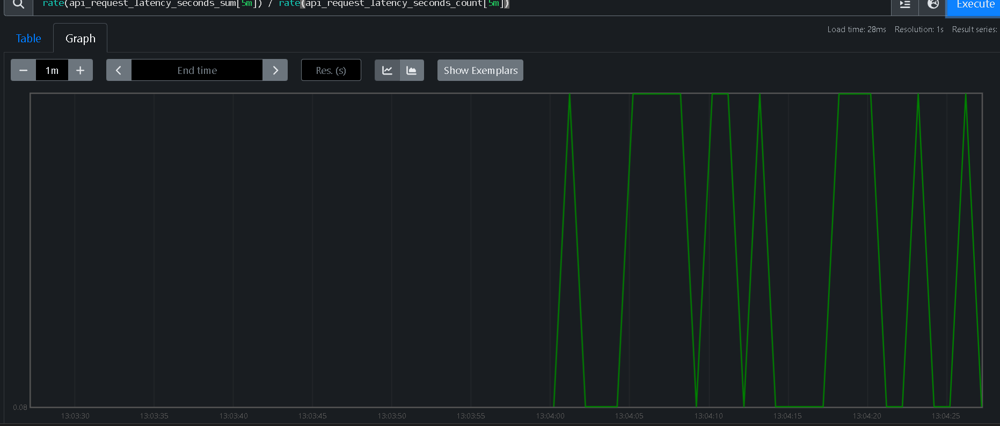
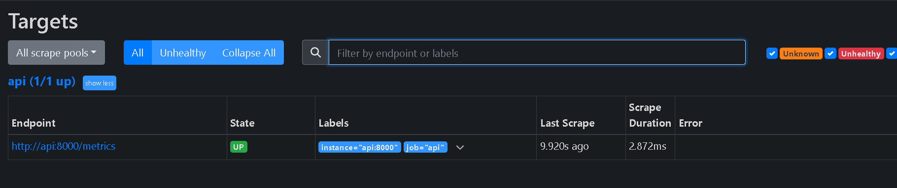
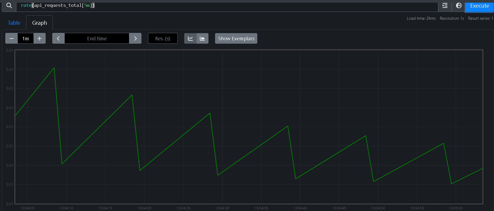
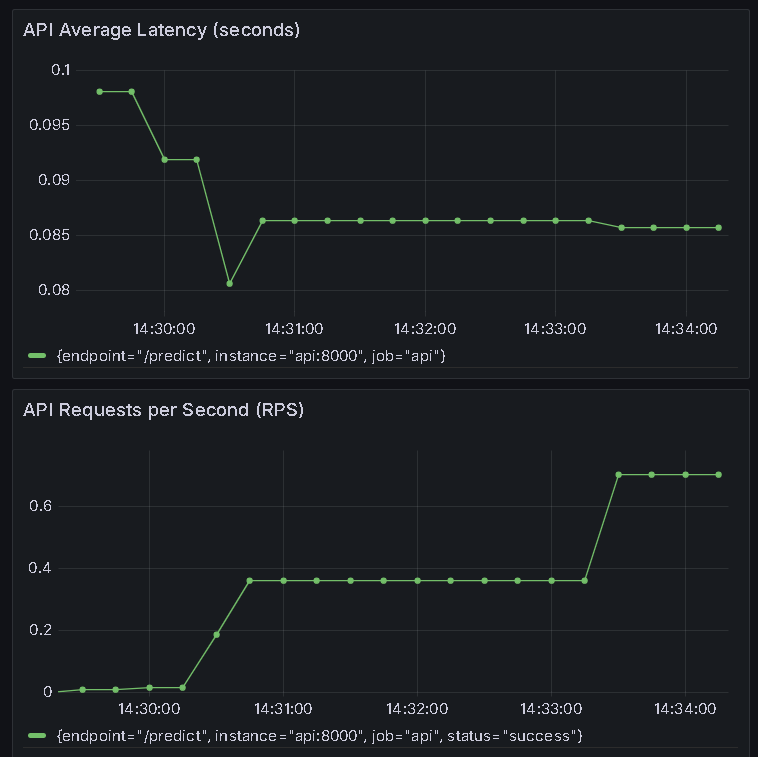
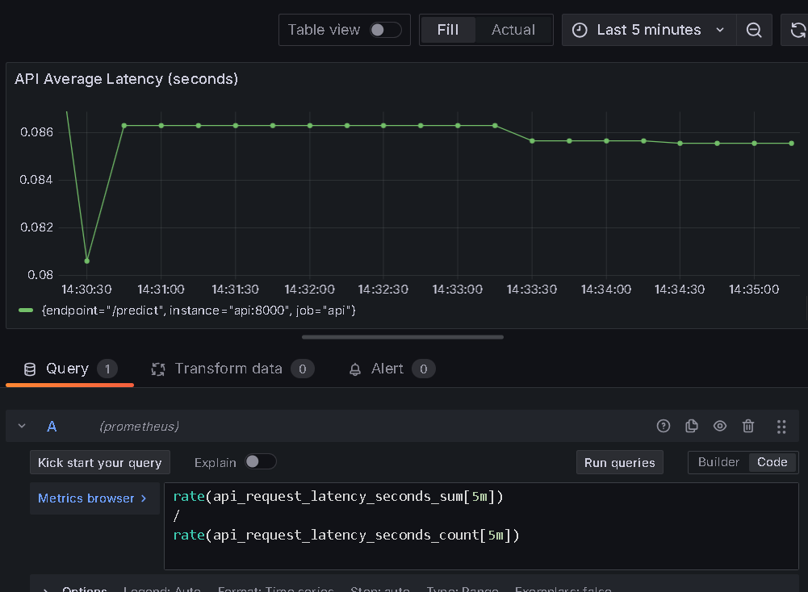
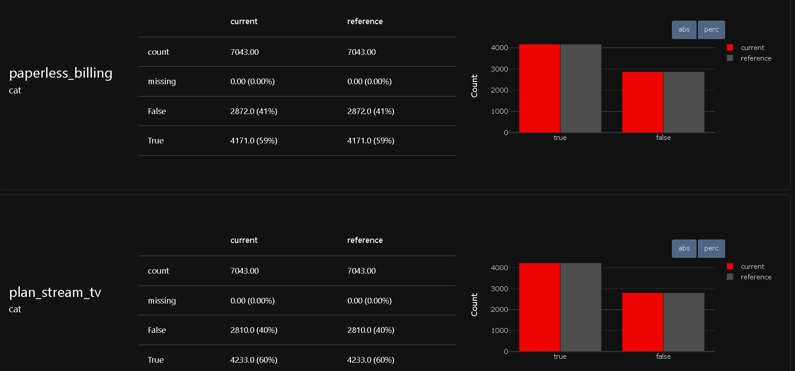

Exercice 1 : 
docker compose ps
NAME                    IMAGE                           COMMAND                  SERVICE      CREATED         STATUS         PORTS
streamflow-grafana      grafana/grafana:11.2.0          "/run.sh"                grafana      2 minutes ago   Up 2 minutes   0.0.0.0:3000->3000/tcp, [::]:3000->3000/tcp
streamflow-prometheus   prom/prometheus:v2.55.1         "/bin/prometheus --c…"   prometheus   2 minutes ago   Up 2 minutes   0.0.0.0:9090->9090/tcp, [::]:9090->9090/tcp
tp1-api-1               tp1-api                         "uvicorn app:app --h…"   api          2 minutes ago   Up 2 minutes   0.0.0.0:8000->8000/tcp, [::]:8000->8000/tcp
tp1-feast-1             tp1-feast                       "bash -lc 'tail -f /…"   feast        2 minutes ago   Up 2 minutes   
tp1-mlflow-1            ghcr.io/mlflow/mlflow:v2.16.0   "mlflow server --bac…"   mlflow       15 hours ago    Up 2 minutes   0.0.0.0:5000->5000/tcp, [::]:5000->5000/tcp
tp1-postgres-1          postgres:16                     "docker-entrypoint.s…"   postgres     19 hours ago    Up 2 minutes   0.0.0.0:5432->5432/tcp, [::]:5432->5432/tcp

Prometheus utilise api:8000 car, dans Docker Compose, les conteneurs se joignent via le nom du service sur le réseau Docker, alors que localhost pointerait sur Prometheus lui-même, pas sur l’API.

Exercice 2 : 
curl http://localhost:8000/metrics
StatusCode        : 200
StatusDescription : OK
Content           : # HELP python_gc_objects_collected_total Objects collected during gc
                    # TYPE python_gc_objects_collected_total counter
                    python_gc_objects_collected_total{generation="0"} 1749.0
                    python_gc_objects_collect...
RawContent        : HTTP/1.1 200 OK
                    Content-Length: 2108
                    Content-Type: text/plain; version=1.0.0; charset=utf-8
                    Date: Thu, 18 Dec 2025 12:16:27 GMT
                    Server: uvicorn

                    # HELP python_gc_objects_collected_total Objects ...
Forms             : {}
Headers           : {[Content-Length, 2108], [Content-Type, text/plain; version=1.0.0; charset=utf-8], [Date, Thu, 18 Dec 2025 12:16:27 GMT], [Server, uvicorn]}
Images            : {}
InputFields       : {}
Links             : {}
ParsedHtml        : mshtml.HTMLDocumentClass
RawContentLength  : 2108

Une moyenne de latence peut masquer les problèmes : quelques requêtes très lentes peuvent être diluées par beaucoup de requêtes rapides.
Un histogramme permet d’observer la distribution et donc de détecter des dégradations intermittentes, des queues longues, ou des pics de latence.
C’est plus utile en production pour fixer des SLO et investiguer les outliers.

Exercice 3 : 

Cette valeur représente la latence moyenne (en secondes) des requêtes observée sur les 5 dernières minutes (somme des latences / nombre de requêtes).

Exercice 4 :
A. Capture 1 – Dashboard Grafana : 

B. Capture 2 – Éditeur de requête d’un panel : 

Les métriques RPS et latence permettent de détecter rapidement des problèmes d’infrastructure ou de charge, comme une hausse soudaine du trafic, une saturation de l’API ou un ralentissement du temps de réponse.
Elles sont très utiles pour identifier des pannes techniques, des régressions de performance ou des erreurs de dimensionnement.
En revanche, ces métriques ne donnent aucune information sur la qualité du modèle (précision, biais, drift des données).
Une API peut répondre rapidement tout en produisant des prédictions incorrectes ou obsolètes.
Ces dashboards constituent donc une première couche d’observabilité, centrée sur le système, mais pas encore sur le comportement ML.

Exercice 5 : 
Capture du rapport Evidently : 

[Evidently] report_html=/reports/evidently/drift_2024-01-31_vs_2024-02-29.html report_json=/reports/evidently/drift_2024-01-31_vs_2024-02-29.json drift_share=0.06 -> NO_ACTION drift_share=0.06 < 0.30 (target_drift=0.0)

Différence covariate drift vs target drift : 
Covariate drift : changement de la distribution des features X entre month_000 et month_001. Même si le label n’a pas changé, les entrées du modèle changent.

Target drift : changement de la distribution de la cible y (ici churn_label), typiquement la proportion de churn entre les deux périodes.