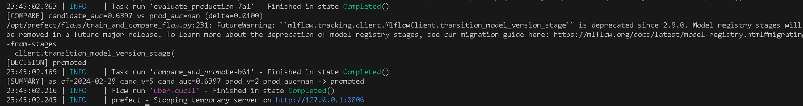
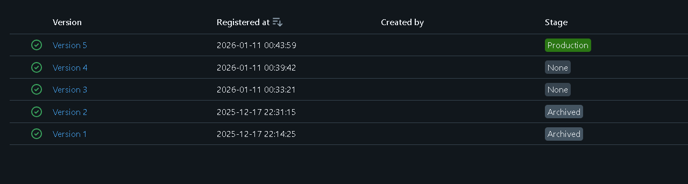
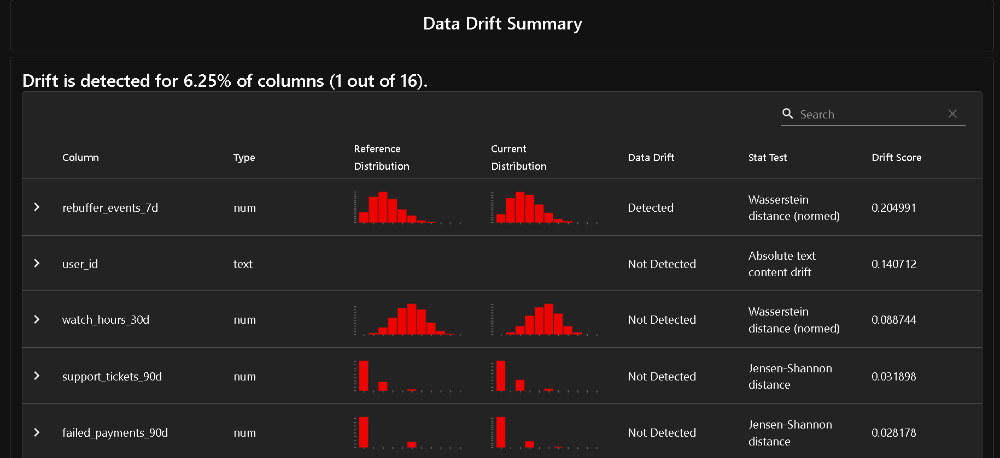

Exercice 1 : 
PS C:\Users\ASUS\Desktop\ML\tp1> docker compose up -d
[+] Running 7/7
 ✔ Container tp1-postgres-1         Running                                                                                                                                              0.0s 
 ✔ Container tp1-mlflow-1           Running                                                                                                                                              0.0s 
 ✔ Container tp1-feast-1            Running                                                                                                                                              0.0s 
 ✔ Container tp1-prefect-1          Running                                                                                                                                              0.0s 
 ✔ Container tp1-api-1              Running                                                                                                                                              0.0s 
 ✔ Container streamflow-prometheus  Running                                                                                                                                              0.0s 
 ✔ Container streamflow-grafana     Running                                                                                                                                              0.0s 
PS C:\Users\ASUS\Desktop\ML\tp1> docker compose ps
NAME                    IMAGE                           COMMAND                  SERVICE      CREATED       STATUS         PORTS
streamflow-grafana      grafana/grafana:11.2.0          "/run.sh"                grafana      2 weeks ago   Up 5 minutes   0.0.0.0:3000->3000/tcp, [::]:3000->3000/tcp
streamflow-prometheus   prom/prometheus:v2.55.1         "/bin/prometheus --c…"   prometheus   2 weeks ago   Up 5 minutes   0.0.0.0:9090->9090/tcp, [::]:9090->9090/tcp
tp1-api-1               tp1-api                         "uvicorn app:app --h…"   api          2 weeks ago   Up 5 minutes   0.0.0.0:8000->8000/tcp, [::]:8000->8000/tcp
tp1-feast-1             tp1-feast                       "bash -lc 'tail -f /…"   feast        2 weeks ago   Up 5 minutes   
tp1-mlflow-1            ghcr.io/mlflow/mlflow:v2.16.0   "mlflow server --bac…"   mlflow       2 weeks ago   Up 5 minutes   0.0.0.0:5000->5000/tcp, [::]:5000->5000/tcp
tp1-postgres-1          postgres:16                     "docker-entrypoint.s…"   postgres     2 weeks ago   Up 5 minutes   0.0.0.0:5432->5432/tcp, [::]:5432->5432/tcp
tp1-prefect-1           tp1-prefect                     "/usr/bin/tini -g --…"   prefect      2 weeks ago   Up 5 minutes

Exercice 2 :
PS C:\Users\ASUS\Desktop\ML\tp1> pytest -q
..                                                                                                                                                                                     [100%]
2 passed in 0.15s

On extrait une fonction pure (sans dépendances Prefect/MLflow, sans I/O) pour pouvoir tester la logique de décision rapidement, de façon déterministe, et sans infrastructure externe.

Exercice 3 : 



Capture MLFLOW : 


 On impose un delta pour éviter de promouvoir un modèle pour un gain trop faible (souvent dû au hasard du split / bruit statistique), et pour stabiliser la production en ne déployant que des améliorations significatives.

 Exercice 4 : 
 Rapport Drift : 
 

[Evidently] ... drift_share=0.06 -> RETRAINING_TRIGGERED drift_share=0.06 >= 0.02 -> skipped
[DECISION] skipped

Exercice 5 :
API – Reload du modèle & prédiction
Appel /predict : 

```bash
curl -s -X POST "http://localhost:8000/predict" \
  -H "Content-Type: application/json" \
  -d '{"user_id":"<UN_USER_ID_REEL>"}'

```

user_id    prediction features
-------    ---------- --------
7590-VHVEG          1 @{user_id=7590-VHVEG; months_active=1; plan_stream_movies=False; paperless_billing=True; plan_stream_tv=False; net_service=DSL; monthly_fee=29,850000381469727; skip...

L’API charge le modèle MLflow au démarrage (models:/streamflow_churn/Production) et le garde en mémoire, après une promotion dans le Registry, il faut redémarrer le service pour recharger la nouvelle version Production.
